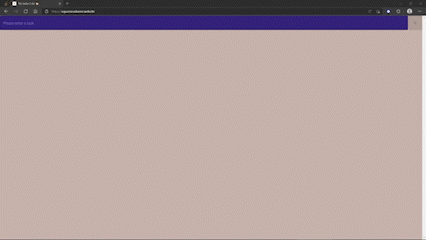
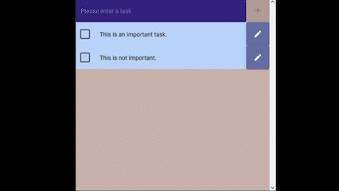

# 2Do ( App for convenience)

- [Install](#installation)
- [Website](#websites)
- [Usage](#usage)
    - [Add task](#add-task)
    - [Rename task](#rename-task)
    - [Finalize task](#finalize-task)
    - [Remove task](#remove-task)
- [Team](#team)

## Installation 

Currently [PWA](https://caniuse.com/?search=PWA) is only supported in Google Chrome and Microsoft Edge :(

## Website

[2Do - App for convenience](https://oguzvuruskaner.website/) 

## Usage

### Add task

### Rename task

### Finalize Task

### Remove Task

## Team
This project is currently developed and maintained by [ovuruska](https://github.com/ovuruska).
